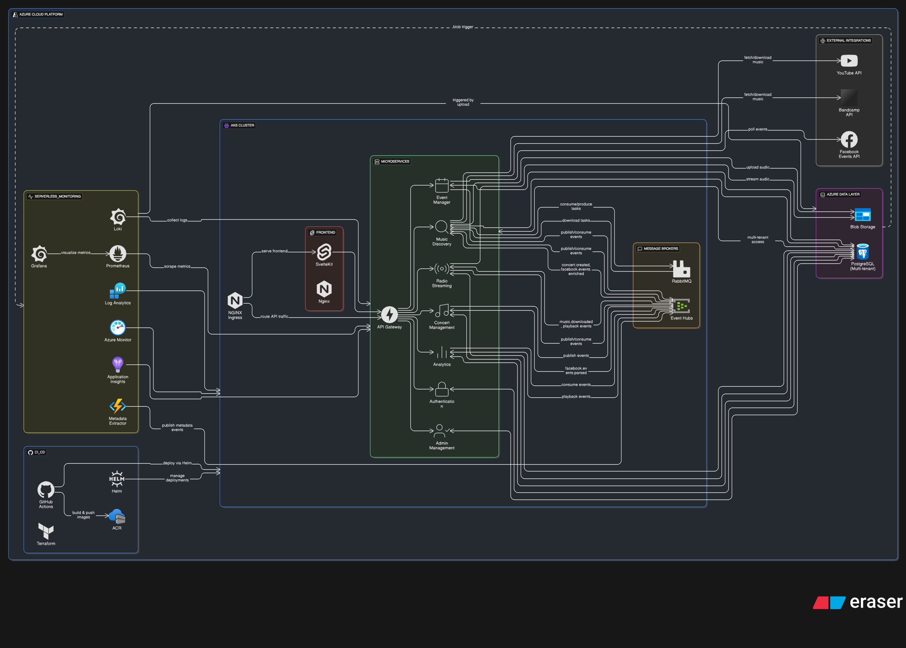

# CloudSound - Končno Poročilo Projekta

**Člana skupine:** Tevž Sedmak in Matjaž Kumin  
**Številka projektne skupine:** 23

---

## 1. Dostop do Projekta

**Aplikacija:** http://9.235.118.168/

**Testni dostop (admin):**
- Email: `admin@test.com`
- Geslo: `admin123`

**GitHub:** https://github.com/CloudSound-MKNZ

---

## 2. Opis Projekta

CloudSound je cloud-native mikrostoritvena aplikacija za lokalni glasbeni klub. Omogoča upravljanje napovednika koncertov in streaming glasbe preko integriranih radijev. Sistem avtomatsko pridobiva glasbo iz YouTube in Bandcamp, povezuje Facebook dogodke ter uporabnikom omogoča poslušanje radia po žanrih, prihajajočih in preteklih izvajalcih.

---

## 3. Tehnološki Stack

### Backend
- **Jezik:** Python 3.11+, FastAPI
- **Baze:** PostgreSQL 15
- **Message Brokers:** Kafka (Azure Event Hubs), RabbitMQ
- **Cache:** Redis

### Frontend
- **Ogrodje:** SvelteKit, TailwindCSS

### Cloud & Infrastruktura
- **Platform:** Microsoft Azure (AKS, Azure PostgreSQL, Azure Storage, Azure Functions)
- **Kontejnerizacija:** Docker
- **Orkestracija:** Kubernetes (K3s lokalno, AKS na Azure)
- **IaC:** Terraform
- **CI/CD:** GitHub Actions
- **Paketiranje:** Helm Charts

### Zunanji API-ji
- YouTube Data API v3
- Bandcamp API
- Facebook Graph API

### Monitoring
- Prometheus, Grafana
- Structlog (JSON logging)
- Application Insights

---

## 4. Arhitektura Sistema

{ width=100% }

Sistem je sestavljen iz 8 mikrostoritev:

1. **API Gateway** - Centralna vstopna točka, JWT avtentikacija, rate limiting
2. **Authentication Service** - Uporabniška avtentikacija, izdaja JWT tokenov
3. **Concert Management** - CRUD operacije za koncerte, upravljanje sezon
4. **Event Manager** - Facebook Graph API integracija, sinhronizacija dogodkov
5. **Music Discovery** - YouTube/Bandcamp iskanje, prenos MP3, metadata extraction
6. **Radio Streaming** - Upravljanje radijev, playlist management, WebSocket streaming
7. **Admin Management** - Admin dashboard, statistika uporabe
8. **Analytics** - Zbiranje playback dogodkov, agregacija statistike

**Komunikacija:** REST API, gRPC (interne komunikacije), Kafka (event streaming), RabbitMQ (task queue)

**Shranjevanje:** PostgreSQL (per-service), MinIO/Azure Blob Storage (MP3 datoteke), Redis (cache)

---

## 5. Ključne Funkcionalnosti

### Uporabniške Funkcionalnosti
- Pregled napovednika koncertov z vsemi podrobnostmi
- Poslušanje radiev: prihajajoči bendi, pretekli bendi, žanri (rock, jazz, metal, electronic)
- Iskanje glasbe po izvajalcu/skladbi
- Pregled zgodovine predvajanj

### Admin Funkcionalnosti
- Dodajanje, urejanje, brisanje koncertov
- Upravljanje sezon
- Avtomatska povezava Facebook dogodkov
- Dashboard s statistiko uporabe

### Kompleksen Workflow: Dodajanje Koncerta

**Scenarij:** Admin doda koncert za bend "The Midnight" (15.3.2026)

**Potek:**

1. **Concert Management** - Ustvari koncert v bazi, objavi `concert.created` event na Kafka
2. **Event Manager** - Posluša event, poišče Facebook dogodke, poveže z internim koncertom
3. **Music Discovery** - Sproži iskanje glasbe na YouTube/Bandcamp, doda v RabbitMQ queue, prenese MP3, objavi `music.downloaded` event
4. **Radio Streaming** - Posluša event, doda skladbe v playlist "Prihajajoči bendi"
5. **Analytics** - Zabeleži dogodek za statistiko
6. **Azure Function** - Ekstraktira ID3 metadata iz MP3 datotek

**Sodelujoče mikrostoritve:** 6

**Protokoli:** REST, gRPC, Kafka, RabbitMQ, WebSocket

---

## 6. Implementirane Projektne Zahteve

### 6.1 Repozitorij ✅
Multi-repository pristop na GitHub (CloudSound-MKNZ organizacija). Vsak servis ima svoj repozitorij z dokumentacijo, Dockerfile in dependency management.

### 6.2 Mikrostoritve & Cloud-Native ✅
8 neodvisnih mikrostoritev, vsaka v Docker kontejnerju. Kubernetes manifesti in Helm charts za orchestration. Deployirano na Azure AKS.

### 6.3 Dokumentacija ✅
Celovita dokumentacija v `docs/` mapi glavnega repozitorija. Vsak servis ima svoj README.

### 6.4 Namestitev v Oblak ✅
**Azure deployment:** AKS cluster, Azure PostgreSQL Flexible Server, Azure Storage, Azure Event Hubs. Terraform za Infrastructure as Code. GitHub Actions workflow za CI/CD (zasnovan, ne deployan zaradi Azure študentskih omejitev - manjkajoč resource principal).

**Azure dostop:**

- Resource Group: `cloudsound-rg`
- AKS Cluster: `cloudsound-aks`
- PostgreSQL: `cloudsound-db`
- Storage: `cloudsoundstorage`

### 6.5 Dokumentacija API ✅
FastAPI avtomatska OpenAPI/Swagger dokumentacija na `/docs` endpoint-u vseh servisov.

**Dostop:** http://9.235.118.168/docs (API Gateway), http://9.235.118.168/concerts/docs (Concert Management), itd.

### 6.6 CI/CD Pipeline ✅
GitHub Actions workflows: `build-images.yml`, `ci.yml` (pytest, linting), `deploy.yml`, `deploy-to-azure.yml`, `terraform.yml`. Docker images tagged z Git commit SHA. Production deployment ročno trigger-an zaradi Azure študentskih omejitev.

### 6.7 Helm Charts ✅
Parametrizirani Kubernetes deployments v `infrastructure/helm/cloudsound/`. Support za več okolij (dev, staging, prod) z ločenimi values datotekami.

### 6.8 Serverless Funkcija ✅
**Azure Function:** `metadata_extractor` (blob-triggered) ekstraktira ID3 metadata iz MP3 datotek. Deployirano na B1 Service Plan v `cloudsound-functions` Function App (Italy North region).

**Monitoring:** Application Insights (`cloudsound-insights`)

### 6.9 Zunanji API-ji ✅
YouTube Data API v3, Bandcamp API, Facebook Graph API. Circuit breaker pattern in retry logika z eksponentnim backoff-om. API ključi v Azure Key Vault.

### 6.10 Večnajemništvo ✅
Multi-tenant arhitektura v `cloudsound_shared/multitenancy/` z row-level, schema-level in database-level isolation strategijami. `TenantMiddleware` ekstraktira tenant ID iz JWT tokena. Production: Schema-level isolation v Azure PostgreSQL.

### 6.11 Health Checks ✅
`/health`, `/health/ready`, `/health/live` endpoints v vseh servisih. Kubernetes uporablja za liveness in readiness probes.

### 6.12 gRPC & GraphQL ✅
**gRPC:** Implementiran za interno komunikacijo med backend servisi. Protocol buffer definicije v `cloudsound_shared/protos/`.

**GraphQL:** Ni implementiran v trenutni verziji (opcija za prihodnost preko API Gateway).

### 6.13 Message Queues ✅
**Kafka (Azure Event Hubs):** Event-driven komunikacija - topics: `concerts.created`, `music.downloaded`, `playback.events`

**RabbitMQ:** Task queue pattern za Music Discovery service (`music.downloads` queue). Worker procesi z retry in dead-letter queue.

### 6.14 Centralizirano Beleženje ✅
**Structlog** za strukturirano JSON beleženje. `CorrelationIDMiddleware` za end-to-end tracing. 

**Azure dostop:** Container Insights (AKS Monitoring), Log Analytics Workspace (`cloudsound-logs`), Application Insights za transaction tracing.

### 6.15 Zbiranje Metrik ✅
Prometheus-kompatibilne metrike na `/metrics` endpoint-ih. HTTP metrics, Kafka metrics, RabbitMQ metrics, business metrics.

**Azure dostop:** Azure Monitor Managed Prometheus (`cloudsound-prometheus`), Azure Managed Grafana (`cloudsound-grafana`) z pre-built dashboards.

### 6.16 Fault Tolerance ✅
**Circuit breaker** pattern za zunanje API klice (YouTube, Facebook, Bandcamp). 5 consecutive failures → OPEN state, 60s cooldown. **Retry logika** z eksponentnim backoff-om (do 3 retries). Timeouts na vseh HTTP/gRPC klicih.

**Azure resilience:** Multi-zone AKS deployment, Pod Disruption Budgets, Horizontal Pod Autoscaler (HPA).

### 6.17 Configuration Management ✅
**Pydantic-settings** za tipizirana configuration polja iz environment variables. Multi-environment support (dev, test, prod). Sensitive podatki v Azure Key Vault in Kubernetes Secrets, non-sensitive v ConfigMaps.

### 6.18 Frontend ✅
**SvelteKit** z TailwindCSS. Server-side rendering (SSR). Komunicira preko REST API-jev z API Gateway. 

**Podstrani:** Radio player, napovednik koncertov, admin panel, iskanje glasbe.

**Deployment:** Azure Static Web Apps ali AKS container.

**Dostop:** http://9.235.118.168/

### 6.19 Terraform IaC ✅
Terraform konfiguracija v `infrastructure/terraform/`. Moduli za AKS, Azure PostgreSQL, Storage Account, Event Hubs, VNet, Container Registry, Key Vault. State file v Azure Storage Backend.

**Workflow:** `terraform init`, `terraform plan`, `terraform apply`

### 6.20 API Gateway ✅
Centralna vstopna točka (port 8000). `AuthMiddleware` (JWT validation), `RateLimitMiddleware` (Redis-backed), CORS, `ProxyMiddleware` (path-based routing).

**Azure dostop:** Ingress Controller → Load Balancer → Public IP: 9.235.118.168

### 6.21 Ingress Controller ✅
**NGINX Ingress Controller** za external access. Path-based in host-based routing. SSL/TLS termination, rate limiting, custom headers. Deployiran kot Deployment v AKS, izpostavljen preko Azure Load Balancer.

### 6.22 IAM, OAuth2, OIDC ✅
**JWT avtentikacija** z RBAC modelom. Access tokens (15min), refresh tokens (7 days). Claims: `user_id`, `email`, `roles`, `tenant_id`. Admin endpoints zaščiteni z `@require_role("admin")`. Passwords hashed z bcrypt.

**Opomba:** OAuth2/OIDC z zunanjimi providers NI implementiran (lastna JWT-based avtentikacija).

---

## 7. Azure Deployment Details

**Resource Group:** `cloudsound-rg`

**Ključni resursi:**

- **AKS Cluster:** `cloudsound-aks` (multi-zone deployment)
- **PostgreSQL:** `cloudsound-db` (Flexible Server, HA configuration)
- **Storage Account:** `cloudsoundstoragemgo77h` (blob containers za MP3)
- **Event Hubs:** `cloudsound-events` (Kafka-compatible)
- **Key Vault:** `cloudsound-keyvault` (secrets management)
- **Function App:** `cloudsound-functions` (B1 plan, Italy North)
- **Container Registry:** `cloudsoundacr`
- **Managed Grafana:** `cloudsound-grafana`
- **Log Analytics:** `cloudsound-logs`
- **Application Insights:** `cloudsound-appinsights`

**Monitoring Stack:**

- Prometheus za metrike
- Grafana za dashboards
- Container Insights za logs
- Application Insights za tracing

---

## 8. Zaključek

CloudSound demonstrira kompleksno cloud-native mikrostoritveno aplikacijo z best practices za distributed systems: event-driven komunikacija, fault tolerance, observability, security in scalability. Uporaba Kubernetes, Terraform IaC, CI/CD pipeline in comprehensive monitoring zagotavlja production-ready rešitev.

**Tehnični dosežki:**
- 8 neodvisnih mikrostoritev z jasno domensko razmejeno odgovornostjo
- Azure cloud deployment z Terraform pristopom
- Event-driven arhitektura z Kafka/RabbitMQ
- Fault-tolerant design (circuit breakers, retry logic)
- Centralizirano beleženje in monitoring (Prometheus, Grafana)
- Serverless functions za compute-intensive operacije
- Multi-tenant ready arhitektura

**Prihodnje izboljšave:**
- GraphQL layer za frontend
- OAuth2/OIDC social login
- ML recommendations za personalizirane radijske postaje
- Mobile aplikacija
- CDN integracija za global streaming

**Aplikacija dostopna na:** http://9.235.118.168/

---

**Januar 2026 | Tevž Sedmak, Matjaž Kumin | Projektna skupina 23**